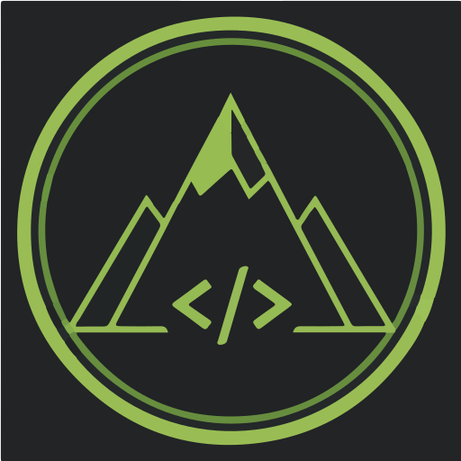

  

---

   

West Coast Code is a technology hobby space. This site is built from the [Astrogen](https://github.com/astrogon/astrogon) site template.

## Acknowledgments

This template was originally inspired by the structures of [zeon-studio](https://github.com/zeon-studio)'s [astroplate](https://github.com/zeon-studio/astroplate), [jordienr](https://github.com/jordienr)'s [astro-design-system](https://github.com/jordienr/astro-design-system) and [TheOtterlord](https://github.com/TheOtterlord)'s [manual](https://github.com/TheOtterlord/manual).

